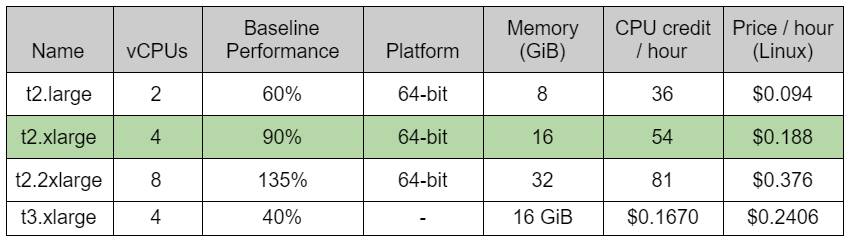

# Documentation AWS pour le projet Big Data

## Création de l’instance EC2
* Dans l’interface graphique, console EC2/instances/lancer des instances.
* Sélection d'une Amazon Machine Image (AMI) : Amazon Linux 2 AMI (éligible à l’offre), 64 bits (x86).
* Choix d’un type d’instance : t2.xlarge
* Configurer les détails de l'instance : sous réseau, us-east-1e (au hasard où il y a des adresses IP disponibles).
* Ajouter le stockage : par défaut.
* Configurer le groupe de sécurité : SSH TCP PORT 22.
* Sélectionner la paire de clés créée précédemment : BigDataProjectKey.pem.

## Accès à l’instance EC2
Dans PuTTY: 
* ec2-54-237-55-173.compute-1.amazonaws.com (adresse IP elastic)
* Clé PPK

## Installations diverses
* Python 3.7.9 (il y avait Python 2 mais ça ne permettait pas de faire tout ce que l’on voulait)
  * pip3 (pour gérer les installations de packages)
  * scikit-learn, numpy, pandas (pour le script de machine learning)
* MongoDB

## Création du S3 bucket
* aws s3 mb s3://databucket1233 --region us-east-1
* Dans l’interface graphique, propriétés:
  * Gestion de version de compartiment : activé
  * Chiffrement par défaut : activé
* Dans l’interface graphique, autorisations:
  * Accès : Bloquer tous les accès publics

## Accéder aux données du S3 bucket
* !wget https://databucket1233.s3.amazonaws.com/data/data.json
* !wget https://databucket1233.s3.amazonaws.com/data/label.csv
* !wget https://databucket1233.s3.amazonaws.com/data/categories_string.csv

## Explication des choix
### Instance de type t2.xlarge
Extrait de documentation AWS (en vert le type d’instance que l’on a choisi) :

Nous avons choisi le type t2.xlarge pour notre instance EC2 car 16 GiB de RAM semble suffisant. En effet, nous étions partis sur 32 GiB au début mais nous avons remarqué qu’en entraînant notre modèle à l’avance sur une machine personnelle, il n’est pas nécessaire d’avoir autant de mémoire. Toutefois, 8 GiB semble trop juste d’où notre choix de 16GB de mémoire vive.
Par ailleurs, nous avons pris le type t2.xlarge plutôt que t3.xlarge car premièrement ce type est moins coûteux. De plus, nous n’avions pas besoin que notre VM AWS puisse avoir une bonne connexion internet donc le type t3.xlarge n’a pas retenu notre attention.
Stockage des données source

### Avantages de l’utilisation de S3 buckets pour le stockage en général :
* Configuration facile des droits d’accès
* Chiffrage de toutes ou parties des données
* Versionnage des fichiers pour limiter la perte d’information
* Date d’expiration configurable
* Fichiers répliqués dans plusieurs datacenters d’AWS pour limiter la perte de données
* Pas de limite de place

Dans notre cas, plus précisément :  
* Avantages du stockage des données source dans un bucket (avant le script python):
* Données chiffrées par AWS.
* Accès public possible (configuration facile des droits d’accès).
* Versionnage des fichiers.

### Stockage des données résultats 

Notre première idée était de stocker les données résultats dans un S3 bucket pour les avantages énoncés précédemment. Toutefois, le script pour le transfert de données du S3 vers la BDD MongoDB distante semblait difficile à mettre en place. Ainsi, nous avons préféré stocker les données directement dans l’instance EC2 car il était plus simple de faire le transfert depuis cet endroit.

